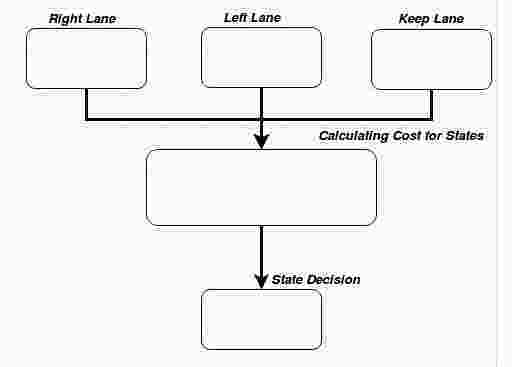

# Udacidy CarND Path Planning Project


## Table Content: ##
- [Objective](#objective)
- [Results](#results)
- [How to run](#howto)
- [Dependencies](#dependency)
- [Directory Structure](#structure)
- [Code Variables](#variables)
- [Flow Details](#details)
- [Path Planning Decisions](#decisions)
- [Discussions](#discussions)


## Objective: <a name="objective"></a>

In this project the goal is to safely navigate around a virtual highway with other traffic that is driving closer to the 50 MPH speed limit. The car's localization and sensor fusion data, there is also a sparse map list of waypoints around the highway. The car should try to go as close as possible to the 50 MPH speed limit, which means passing slower traffic when possible, note that other cars will try to change lanes too. The car should avoid hitting other cars at all cost as well as driving inside of the marked road lanes at all times, unless going from one lane to another. The car should be able to make one complete loop around the 6946m highway. Since the car is trying to go 50 MPH, it should take a little over 5 minutes to complete 1 loop. Also the car should not experience total acceleration over 10 m/s^2 and jerk that is greater than 50 m/s^3.

## Results: <a name="results"></a>

Small video captures are shown below but if you want to see the entire loop of the track please refer to this link.

Right Turn:


Left Turn:


Slow Down:


Entire video capture is uploaded to youtube link: [Full Video](https://youtu.be/dvzRbEtZYv4)


## How to run: <a name="howto"></a>

This project is done in a simulator and Term 3 Simulator can be downloaded [here](https://github.com/udacity/self-driving-car-sim/releases)

Buiding instructions as follow:
1. Clone this repo.
2. Make a build directory: `mkdir build && cd build`
3. Compile: `cmake .. && make`
4. Run it: `./path_planning`.

## Dependencies <a name="dependency"></a>

* cmake >= 3.5
 * All OSes: [click here for installation instructions](https://cmake.org/install/)
* make >= 4.1
  * Linux: make is installed by default on most Linux distros
  * Mac: [install Xcode command line tools to get make](https://developer.apple.com/xcode/features/)
  * Windows: [Click here for installation instructions](http://gnuwin32.sourceforge.net/packages/make.htm)
* gcc/g++ >= 5.4
  * Linux: gcc / g++ is installed by default on most Linux distros
  * Mac: same deal as make - [install Xcode command line tools]((https://developer.apple.com/xcode/features/)
  * Windows: recommend using [MinGW](http://www.mingw.org/)
* [uWebSockets](https://github.com/uWebSockets/uWebSockets)
  * Run either `install-mac.sh` or `install-ubuntu.sh`.
  * If you install from source, checkout to commit `e94b6e1`, i.e.
    ```
    git clone https://github.com/uWebSockets/uWebSockets 
    cd uWebSockets
    git checkout e94b6e1
    ```
	
## Directory Structure <a name="structure"></a>
The directory structure of this repository is as follows:

```
root
|   CMakeLists.txt
|   cmakepatch.txt
|   README.md
|   data
|   install-ubuntu.sh
|   install-mac.sh
|   src
|
|___videos
|   |
|   |  rightTurn.gif
|   |  leftTurn.gif
|   |  slowDown.gif
|
|
|___src
|   |   main.cpp
|   |   spline.h
|   |   json.hpp
|   |   Eigen-3.3
|
|
|___data
    |   
    |  highway_map.csv

```

## Code Variables <a name="variables"></a>

["x"] The car's x position in map coordinates

["y"] The car's y position in map coordinates

["s"] The car's s position in frenet coordinates

["d"] The car's d position in frenet coordinates

["yaw"] The car's yaw angle in the map

["speed"] The car's speed in MPH
//Note: Return the previous list but with processed points removed, can be a nice tool to show how far along
the path has processed since last time. 

["previous_path_x"] The previous list of x points previously given to the simulator

["previous_path_y"] The previous list of y points previously given to the simulator

["end_path_s"] The previous list's last point's frenet s value

["end_path_d"] The previous list's last point's frenet d value

["sensor_fusion"] A 2d vector of cars and then that car's [car's unique ID, car's x position in map coordinates, car's y position in map coordinates, car's x velocity in m/s, car's y velocity in m/s, car's s position in frenet coordinates, car's d position in frenet coordinates. 

## Flow Details <a name="details"></a>

1. The car uses a perfect controller and will visit every (x,y) point it recieves in the list every .02 seconds. The units for the (x,y) points are in meters and the spacing of the points determines the speed of the car. The vector going from a point to the next point in the list dictates the angle of the car. Acceleration both in the tangential and normal directions is measured along with the jerk, the rate of change of total Acceleration. The (x,y) point paths that the planner recieves should not have a total acceleration that goes over 10 m/s^2, also the jerk should not go over 50 m/s^3. (NOTE: As this is BETA, these requirements might change. Also currently jerk is over a .02 second interval, it would probably be better to average total acceleration over 1 second and measure jerk from that.

2. There will be some latency between the simulator running and the path planner returning a path, with optimized code usually its not very long maybe just 1-3 time steps. During this delay the simulator will continue using points that it was last given, because of this its a good idea to store the last points you have used so you can have a smooth transition. previous_path_x, and previous_path_y can be helpful for this transition since they show the last points given to the simulator controller with the processed points already removed. You would either return a path that extends this previous path or make sure to create a new path that has a smooth transition with this last path.
      
## Path Planning Decisions <name="decisions"></a>

I took a straigforward approach with the limit of states and created only three states: Right Lane, Left Lane, and Keep Lane. To decide which state is the car be in, cost of each state calculated based on Feasibility, Collision, Danger, and Efficiency and each creteria is a constant multiplier. 

	double feasibility = pow(10,7); // Feasibility = 10**7
	double collision = pow(10,6); //COLLISION  = 10 ** 6
	double danger = pow(10,5); //DANGER     = 10 ** 5
	double reachGoal = pow(10,5); //REACH_GOAL = 10 ** 5
	double efficiency = pow(10,2); //EFFICIENCY = 10 ** 2 multiplier 

As the flow below indicates that each state is an associated cost and decision is made based on the comparison of the cost funtion results.
 


    	if (it->first == 0){
    		costMap[0] += feasibilityCost(lane-1);
    		if (costMap[0] == 0){
    			costMap[0] += collisionCost(sensorVec, lane-1, prevSize, car_s);
    			costMap[0] += changeLaneLeftCost();
    			costMap[0] += bufferCost(sensorVec, lane-1, prevSize, car_s);
    		}
    	}
    	//Right
    	else if (it->first == 1){
    		costMap[1] += feasibilityCost(lane+1);
    		if (costMap[1] == 0){
    			costMap[1] += collisionCost(sensorVec, lane+1, prevSize, car_s);
    			costMap[1] += changeLaneRightCost();
    			costMap[1] += bufferCost(sensorVec, lane+1, prevSize, car_s);
    		}
    	}
    	//Keep Lane
    	if (it->first == 2){
    		costMap[2] += feasibilityCost(lane);
    		if (costMap[2] == 0){
    			costMap[2] += collisionCost(sensorVec, lane, prevSize, car_s);
    			costMap[2] += keepLaneCost();
    			costMap[2] += bufferCost(sensorVec, lane, prevSize, car_s);
    		}
    	}

         
## Discussions <a name="discussions"></a>

Sometime car can get stuck behind a slow car if the next lane car relatively same speed and following little behind. In such a case, the car could slow down and move to the very last right lane. Another thing that i noticed is the car go beyond the jerk limit while the road has a curve. Lastly, there is no differentiation between right and left lane but it could be added as an improvement. 

